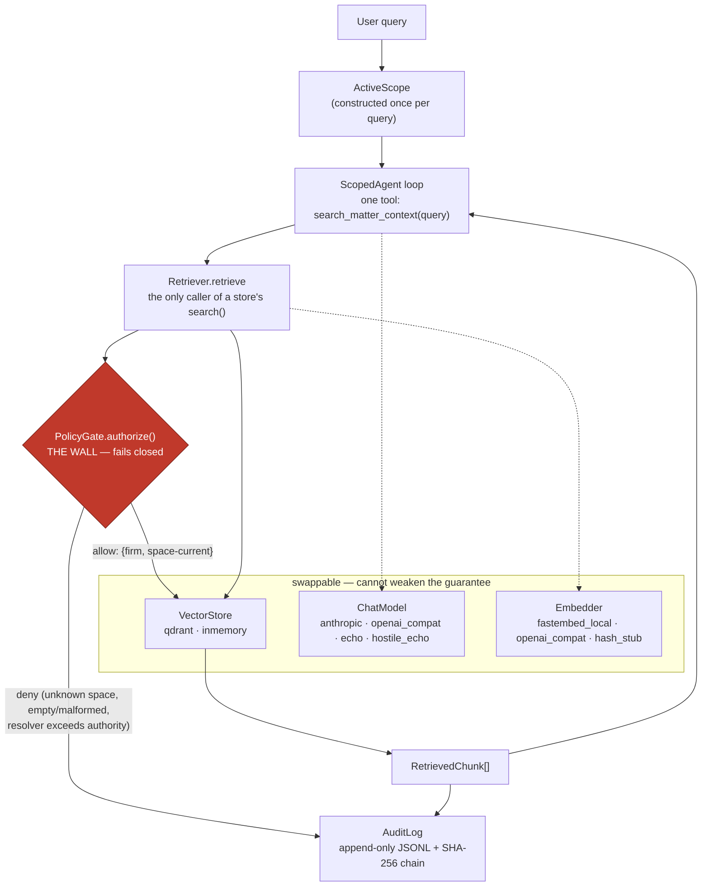
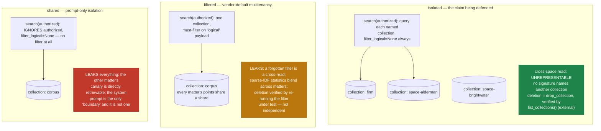
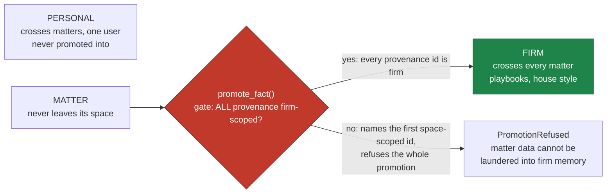

# Architecture

Three diagrams and a module-by-module contract. The one thing to hold onto while reading: every
retrieval, from every provider, through every backend, is a call to `PolicyGate.authorize()`, and
nothing reaches a vector store except through it.

## 1. The request path

A query enters, is bound to exactly one `ActiveScope`, and drives an agent loop that can call one
tool with one string parameter. That tool call goes through the retriever, which asks the gate to
authorize it. The gate is the only red box on the page: it is the wall. Everything in the dashed
subgraph — the chat model, the embedder, the vector store — is swappable and *cannot* weaken the
guarantee, because none of it can reach the gate.



The audit log receives *both* edges: an allow-receipt naming what was returned, and a deny-receipt
naming why the request was refused. Receipts never carry the query text — only a SHA-256
fingerprint of it.

## 2. The three backends, side by side

All three implement the same `StorageMode` contract over the same logical vocabulary (a firm
collection plus one `space-<id>` per matter). They differ only in how that vocabulary maps onto
physical storage — and that difference is the entire finding.



## 3. Memory tiers and the promotion gate

Retrieval's learning-side analogue. Three tiers; a fact may be promoted from matter to firm only
if *every* provenance ID is firm-scoped. One space-scoped source refuses the whole promotion, by
name. There is no override flag — the same design principle as "no collection parameter on the
retriever."



## Module contract

| module | role | invariant it upholds |
| --- | --- | --- |
| `policy.py` | **the gate** — `PolicyGate.authorize()` | The wall. Fails **closed**: unknown space, empty/malformed request, resolver exception, timeout, empty/malformed allowlist, or a resolver returning a collection outside `scope.allowed_collections` all raise `ScopeViolation`. 100% line coverage; mutation-tested; no partial grants. |
| `model.py` | the types | A cross-space read is unrepresentable at the type level. `DocumentId` cross-validates scope↔space_id both ways; `ActiveScope` is the *only* source of retrieval authority and derives its allowlist to exactly `{firm, space-<id>}`. |
| `retriever.py` | the single caller of a store's `search()` | No public signature accepts a collection name or a filter — a leak test asserts this by introspection, and a CI grep asserts no other module calls `StorageMode.search`. Always requests the scope's own allowlist, then narrows through the gate. Writes a receipt on both allow and deny. |
| `stores/isolated.py` | the defended layout | One physical collection per logical collection; `search()` passes `filter_logical=None` because the collection *is* the boundary. No parameter anywhere accepts a foreign collection. Deletion is `drop_collection`, verified by `list_collections()` — external to the query path. |
| `stores/filtered.py` | vendor-default multitenancy | One `corpus` collection, `must`-filter on the `logical` payload. This file is where the freedom the isolated layout removes gets reintroduced: a forgotten filter is a cross-read, and deletion can only be checked by re-running the filter under test. Findings 2–4 live here on purpose. |
| `stores/shared.py` | prompt-only isolation | One `corpus` collection; `search()` accepts `authorized` and then ignores it. Deliberately weak, asserted red in CI — "fixing" it would delete the negative example the suite needs. |
| `providers/*`, `embedders/*` | swappable adapters | Speak only neutral types (`providers/base.py`, `embedders/base.py`). No provider name or `isinstance` check appears above the adapter boundary (CI grep enforced). A malformed tool call becomes an error result, never a crash — so a hostile or broken model cannot take down the loop. |
| `audit.py` | the log | Append-only JSONL; each line's `prev_sha256` chains to the SHA-256 of the previous line. `verify_log` detects and names a mutated middle line; a final-line mutation is undetectable without an external anchor — see [threat-model.md](threat-model.md). |
| `memory.py` | the promotion gate | `promote_fact()` promotes matter→firm iff every provenance id is firm-scoped; empty provenance and the first space-scoped id both refuse, by name. No override flag. |
| `demo.py` | the matrix | Builds the *real* stack for every (backend, provider) cell and records the color the PRP predicts vs the color reality produced. `render_text(run_matrix())` is literally the README table. |

### The demo matrix

`chancel demo --no-llm` builds the real stack — `PolicyGate`, `Retriever`, `ScopedAgent`, the
generated synthetic corpus, the `hash_stub` embedder, the `inmemory` store — for every cell and
compares predicted color against actual:

```
finding                 backend   provider      expected  actual  ok
----------------------  --------  ------------  --------  ------  --
canary-leak             isolated  echo          clean     clean   ✓
canary-leak             isolated  hostile_echo  clean     clean   ✓
unrepresentable-call    isolated  n/a           denied    denied  ✓
deletion-verifiability  isolated  n/a           clean     clean   ✓
canary-leak             filtered  echo          clean     clean   ✓
canary-leak             filtered  hostile_echo  clean     clean   ✓
unrepresentable-call    filtered  n/a           leaked    leaked  ✓
deletion-verifiability  filtered  n/a           leaked    leaked  ✓
canary-leak             shared    echo          leaked    leaked  ✓
canary-leak             shared    hostile_echo  leaked    leaked  ✓
unrepresentable-call    shared    n/a           leaked    leaked  ✓
deletion-verifiability  shared    n/a           leaked    leaked  ✓

PASS: 12/12 cells matched their predicted color
```

`PASS` means every prediction held — *including the reds being red*. A `✗` is the alarm: a
backend diverged from what this repo claims about it.
